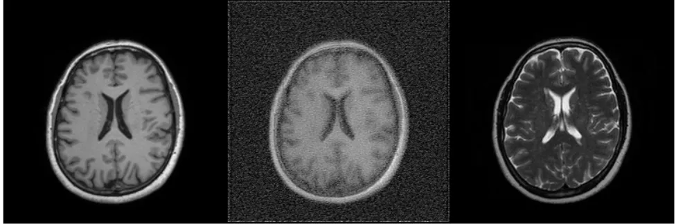

# Cycle-DDPM
    添加了循环一致性损失得DDPM模型

## 项目结构
    - train_ddpm.py 训练该模型，基础配置文件
    - cycle_ddpm.py 加入了cycle_loss的DDPM模型
    - diffusion_unet.py 用于DDPM的Unet模型，采用的Hugging face的专用于扩散模型的Unet
    - plot.py 用于画图
    - scehedule.py 设置Diffusion model 基本的相关函数
    - load.py 用于加载数据集，数据集的格式为
        - t1:
            - 0001.png
            - 0002.png
            - ......
        - t2:
            - 0001.png
            - 0002.png
            - ......
    - test.py 用于测试模型的转换和生成效果

## 使用方法
1. 配置数据集
   - 数据集的格式为png
2. 安装依赖
    ```bash
    pip install -r requirements.txt
   ```
3. 训练模型
   - 运行train_ddpm.py 
4. 测试模型
   - 运行test.py

## 进度说明

### 2025.8.10
    1. 上传该项目到github
    2. 修改了lambda_cycle 的 权重为：前epochs//2 为 0 ，后epochs//2 为 1
    3. 效果很差
#### 效果图
    1. 在计算循环一致性损失时的生成图对比：


    2. 循环损失一直无法下降，连两个ddpm模型的损失也降不下去


### 2025.8.11
1. 将训练集样本个数降低到30个
2. 将epoch提升至200个

#### 效果图
    1. 训练后，单个模型的损失降低到0.01左右，但是循环一致性损失还是很高


    2. 但是测试集发现效果已经出现了


### 2025.8.12
    1. 将循环一致性损失的权重由1设置为0.1
    2. 添加了灰度一致性损失，正在训练中...
### 2025.8.13

    1. 昨天的模型训练好后，生成的图像效果变好


    2. 更新lamabda_cycle权重由0.1变回1
    3. 更改函数生成时的生成函数算法部分，还需要训练...

### 2025.8.17
    1. 发现normalize部分有问题，应该把图像转化到[-1,1]之间，但是训练了40个epochs后效果很差。

<table>
    <tr>
        <td>输入图像</td>
        <td>生成图像</td>
        <td>目标图像</td>
    </tr>
    <tr>
         <td colspan=3>
            
         </td>
    </tr>
</table>

    2. 发现之前代码也有问题，在训练时把取消设置推理为True
    3. 接着训练，且发现之前训练忘了加入灰度一致性损失，已经加上了，且参数如下：
```python
device=torch.device("cuda" if torch.cuda.is_available() else "cpu"),
dir_a_path="D:/0-nebula/dataset/ixi_paried/t1_30_resized",
dir_b_path="D:/0-nebula/dataset/ixi_paried/t2_30_resized",
lambda_cycle=0.1,
lambda_gray=1,
image_size=256,
batch=1,  # 如果batch_size过小会导致梯度不稳定啊!
epochs=40, 
lr=2e-5,  # 提高学习率加快收敛
clip=1.0,
num_train_timesteps=500,
num_inference_timesteps=20,  # 增加推理步数提高生成质量
beta_start=0.0001,  # 降低beta起始值
beta_end=0.02,  # 调整beta结束值
```